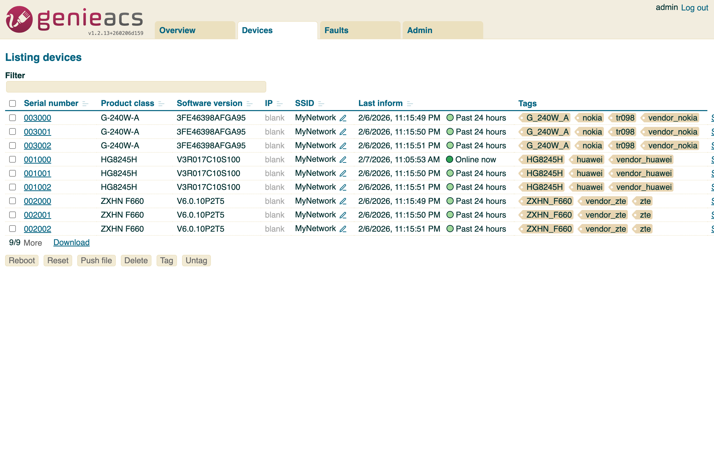
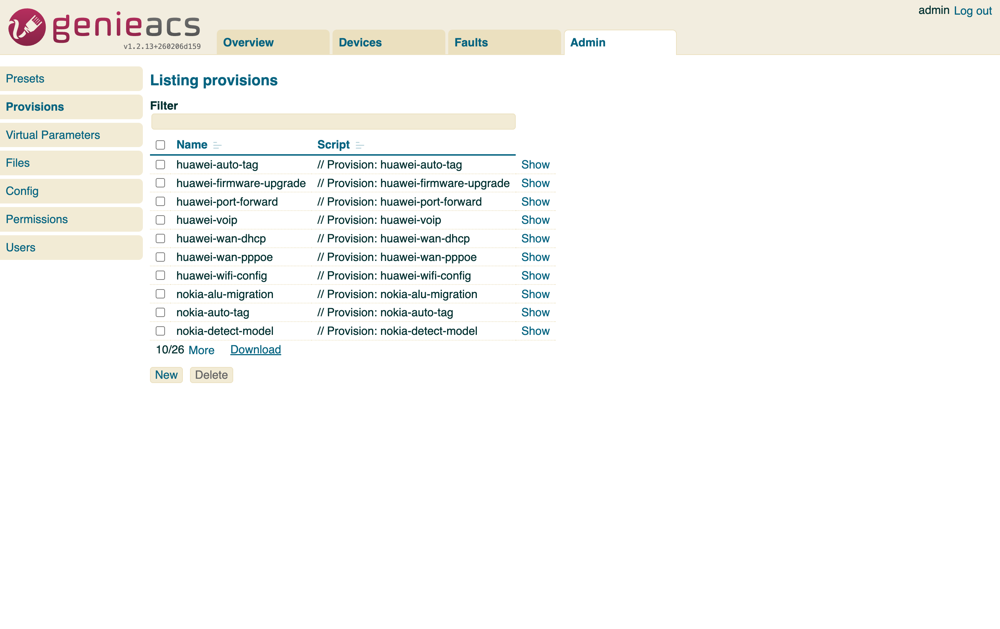
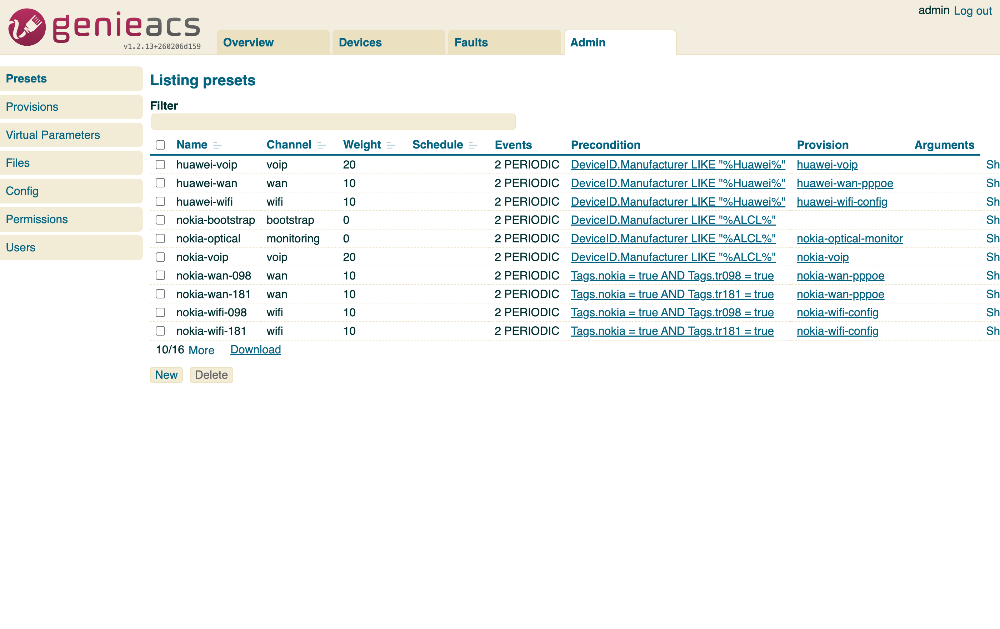
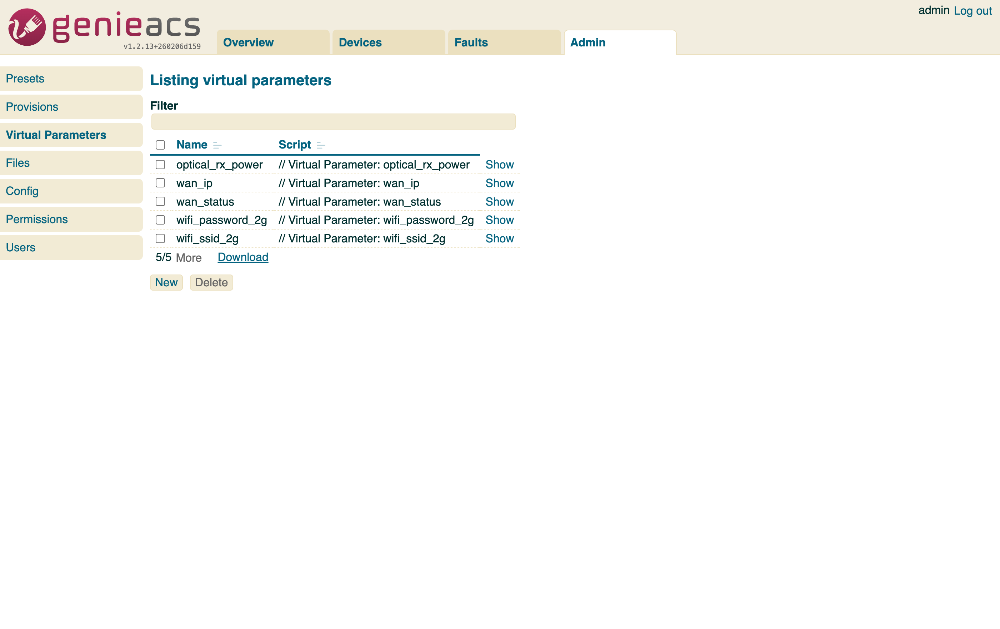
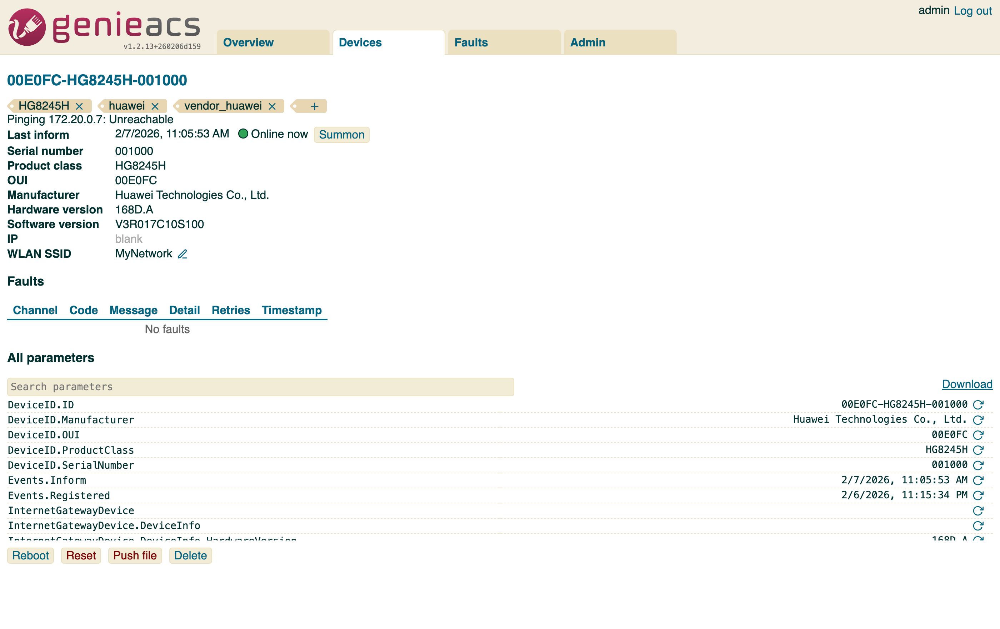
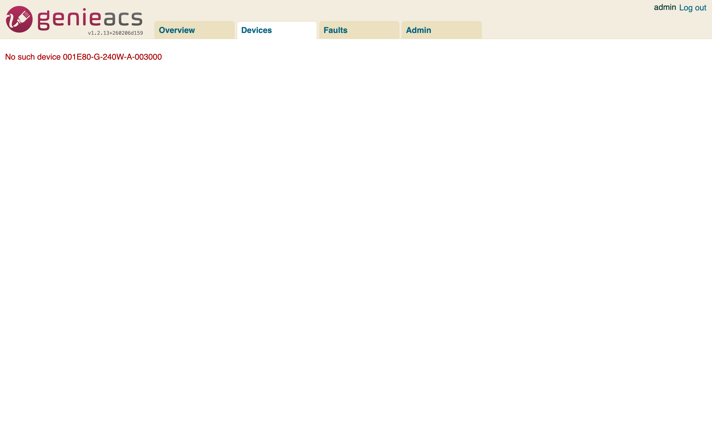
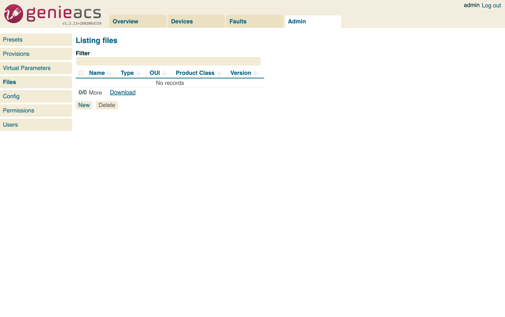

# GenieACS Device Provisioning: Complete How-To Guide

> A comprehensive, step-by-step guide for provisioning CPE devices through GenieACS — covering WiFi band configuration, unified SSID setup, WAN connectivity, VoIP, optical monitoring, firmware upgrades, and multi-vendor management for Huawei, ZTE, and Nokia ONTs.

---

## Table of Contents

1. [Architecture Overview](#1-architecture-overview)
2. [Getting Started — First Boot](#2-getting-started--first-boot)
3. [Understanding the Provisioning Pipeline](#3-understanding-the-provisioning-pipeline)
4. [WiFi Band Configuration](#4-wifi-band-configuration)
   - 4.1 [Current Band Support Analysis](#41-current-band-support-analysis)
   - 4.2 [Configuring 2.4 GHz WiFi](#42-configuring-24-ghz-wifi)
   - 4.3 [Configuring 5 GHz WiFi](#43-configuring-5-ghz-wifi)
   - 4.4 [Unified SSID — Making Bands Work Together](#44-unified-ssid--making-bands-work-together)
   - 4.5 [Band Steering and Smart Connect](#45-band-steering-and-smart-connect)
   - 4.6 [WiFi 6/6E and WPA3 Considerations](#46-wifi-66e-and-wpa3-considerations)
5. [WAN Configuration](#5-wan-configuration)
   - 5.1 [PPPoE Setup](#51-pppoe-setup)
   - 5.2 [DHCP Setup](#52-dhcp-setup)
   - 5.3 [VLAN Tagging](#53-vlan-tagging)
6. [VoIP / SIP Configuration](#6-voip--sip-configuration)
7. [Port Forwarding / NAT Rules](#7-port-forwarding--nat-rules)
8. [Optical Power Monitoring](#8-optical-power-monitoring)
9. [Firmware Upgrades](#9-firmware-upgrades)
   - 9.1 [Uploading Firmware Files](#91-uploading-firmware-files)
   - 9.2 [Triggering a Firmware Download via NBI](#92-triggering-a-firmware-download-via-nbi)
   - 9.3 [Staged Rollouts with Tags](#93-staged-rollouts-with-tags)
   - 9.4 [Automated Firmware Logging](#94-automated-firmware-logging)
10. [Writing Your Own Provisions](#10-writing-your-own-provisions)
11. [Virtual Parameters — Vendor Abstraction Layer](#11-virtual-parameters--vendor-abstraction-layer)
12. [Presets — Trigger Rules](#12-presets--trigger-rules)
13. [Deploying Provisions at Scale](#13-deploying-provisions-at-scale)
14. [Troubleshooting](#14-troubleshooting)
15. [Appendix: Vendor Parameter Reference](#15-appendix-vendor-parameter-reference)

---

## 1. Architecture Overview

GenieACS is a TR-069/CWMP Auto Configuration Server composed of four microservices:

```
                   +-----------+
                   |  MongoDB  |
                   +-----+-----+
                         |
       +-----------------+-----------------+
       |                 |                 |
  +----+----+      +-----+-----+     +----+----+
  |  CWMP   |      |    NBI    |     |   FS    |
  | :7547   |      |   :7557   |     |  :7567  |
  | TR-069  |      |  REST API |     |  Files  |
  +----+----+      +-----+-----+     +----+----+
       |                 |                 |
       |           +-----+-----+           |
       +---------->|    UI     |<----------+
                   |   :3000   |
                   +-----------+
```

| Service | Port | Role |
|---------|------|------|
| **CWMP** | 7547 | Speaks TR-069 SOAP/XML with devices |
| **NBI** | 7557 | REST API for external automation |
| **FS** | 7567 | Serves firmware/config files via GridFS |
| **UI** | 3000 (mapped to 3001 in Docker) | Web admin interface |

**Screenshot: Overview Dashboard**
> 
>
> *The GenieACS overview page showing 9 registered devices across 3 vendors — Huawei HG8245H (3), ZTE ZXHN F660 (3), Nokia G-240W-A (3). All devices are online with zero faults.*

---

## 2. Getting Started — First Boot

When a CPE device connects to GenieACS for the first time, the following happens automatically:

```
Device Power On
      |
      v
[1] Device sends CWMP Inform (SOAP/XML to port 7547)
      |-- Contains: DeviceID (Manufacturer, OUI, ProductClass, SerialNumber)
      |-- Contains: Events (e.g., "0 BOOTSTRAP", "2 PERIODIC")
      |-- Contains: ParameterList (current parameter values)
      |
      v
[2] GenieACS CWMP service receives Inform
      |-- Stores/updates device in MongoDB `devices` collection
      |-- Extracts events and parameter values
      |
      v
[3] Preset Matching Engine runs
      |-- Evaluates ALL presets against this device
      |-- Checks: events match? precondition match?
      |-- Lower weight = higher priority (weight 0 runs first)
      |
      v
[4] Matched provisions execute in sandbox
      |-- Each provision is a JavaScript function
      |-- Uses declare() API to read/write device parameters
      |-- Can tag devices, set WiFi SSID, configure WAN, etc.
      |
      v
[5] GenieACS generates RPCs (GetParameterValues, SetParameterValues)
      |-- Sends to device in the same CWMP session
      |-- Device applies changes and responds
      |
      v
[6] Session commits — changes saved to MongoDB
```

**Screenshot: Devices List**
> 
>
> *All 9 registered devices showing serial numbers, product classes, firmware versions, SSIDs (all set to "MyNetwork"), and auto-applied tags (huawei/zte/nokia, vendor_*, model-specific).*

---

## 3. Understanding the Provisioning Pipeline

The provisioning system has three components that work together:

### 3.1 Provisions (The Scripts)

Provisions are JavaScript functions that run in a sandboxed environment. They use the `declare()` API to read and write device parameters.

```javascript
// The declare() API — the heart of provisioning
declare(path, timestamps, values);
```

- **path**: TR-069 parameter path (e.g., `"InternetGatewayDevice.LANDevice.1.WLANConfiguration.1.SSID"`)
- **timestamps**: When to refresh the value from device (`{value: now}` = refresh now)
- **values**: What to set (`{value: "MySSID"}` = write this value)

**Screenshot: Admin > Provisions**
> 
>
> *The Admin > Provisions page showing all 26 deployed provision scripts organized by vendor: universal (4), huawei (7), zte (7), nokia (8).*

### 3.2 Presets (The Triggers)

Presets define WHEN a provision runs. They contain:

| Field | Purpose | Example |
|-------|---------|---------|
| **weight** | Priority (lower = first) | `0` for bootstrap, `10` for config |
| **channel** | Grouping label | `"wifi"`, `"wan"`, `"bootstrap"` |
| **events** | Which Inform events trigger it | `{"2 PERIODIC": true}` |
| **precondition** | Device filter expression | `"DeviceID.Manufacturer LIKE \"%Huawei%\""` |
| **configurations** | Which provisions to run | `[{"type": "provision", "name": "huawei-wifi-config"}]` |

**CRITICAL**: Event matching uses AND logic, not OR. If you specify `{"0 BOOTSTRAP": true, "2 PERIODIC": true}`, the device must report BOTH events in the same Inform message. Most devices only send one event type per session.

**Screenshot: Admin > Presets**
> 
>
> *The Admin > Presets page showing all 16 deployed presets with their channels, events, and preconditions.*

### 3.3 Virtual Parameters (The Abstraction Layer)

Virtual Parameters create vendor-agnostic parameter paths. Instead of knowing each vendor's specific TR-069 path, you use a single unified path.

```
VirtualParameters.wifi_ssid_2g
    |
    +-- Huawei: InternetGatewayDevice.LANDevice.1.WLANConfiguration.1.SSID
    +-- ZTE:    InternetGatewayDevice.LANDevice.1.WLANConfiguration.1.SSID
    +-- Nokia (TR-098): InternetGatewayDevice.LANDevice.1.WLANConfiguration.1.SSID
    +-- Nokia (TR-181): Device.WiFi.SSID.1.SSID
```

**Screenshot: Admin > Virtual Parameters**
> 
>
> *The Admin > Virtual Parameters page showing the 5 deployed virtual parameters: wifi_ssid_2g, wifi_password_2g, wan_status, wan_ip, optical_rx_power.*

---

## 4. WiFi Band Configuration

### 4.1 Current Band Support Analysis

Our codebase currently supports **two WiFi bands**:

| Band | Frequency | Standard | Status |
|------|-----------|----------|--------|
| 2.4 GHz | 2.4 GHz | 802.11b/g/n | Fully supported |
| 5 GHz | 5 GHz | 802.11a/n/ac | Fully supported |
| 6 GHz (WiFi 6E) | 6 GHz | 802.11ax | Not yet supported |

**What's supported per vendor:**

| Feature | Huawei HG8245H | ZTE ZXHN F660 | Nokia G-240W-A |
|---------|---------------|---------------|----------------|
| 2.4 GHz config | Wildcard discovery | Hardcoded inst 1 | TR-098 inst 1 |
| 5 GHz config | Wildcard discovery | Hardcoded inst 5 | TR-098 inst 5 / TR-181 Radio.2 |
| Security | WPA2 (BeaconType=11i) | WPA2 (BeaconType=11i) | WPA2-Personal (TR-181) |
| Password path | PreSharedKey.1.KeyPassphrase | KeyPassphrase (direct) | PreSharedKey.1.KeyPassphrase |
| Virtual params | 2.4 GHz only | 2.4 GHz only | 2.4 GHz only |

**Gap analysis:**
- 5 GHz virtual parameters (`wifi_ssid_5g`, `wifi_password_5g`) are referenced in documentation but have NOT been created yet
- No WiFi 6/6E support (802.11ax parameters not exposed by current ONT firmware)
- No WPA3 support (requires newer firmware on ONTs)
- No band steering configuration (vendor-specific, not in TR-069 standard)

### 4.2 Configuring 2.4 GHz WiFi

#### Option A: Vendor-Specific Provision (Recommended for production)

**For Huawei ONTs** — uses wildcard discovery to find WLAN instances dynamically:

```javascript
// provisions/huawei/huawei-wifi-config.js
const SSID_24 = "MyNetwork";
const PASSWORD = "SecurePassword123";
const now = Date.now();

// Discover all WLAN instances
let wlanInstances = declare(
  "InternetGatewayDevice.LANDevice.1.WLANConfiguration.*",
  {path: now}
);

let instances = [];
for (let inst of wlanInstances) {
  instances.push(inst);
}

// First instance = 2.4 GHz
if (instances.length >= 1) {
  let path24 = instances[0].path;
  declare(path24 + ".Enable", {value: now}, {value: true});
  declare(path24 + ".SSID", {value: now}, {value: SSID_24});
  declare(path24 + ".BeaconType", {value: now}, {value: "11i"});
  declare(path24 + ".WPAEncryptionModes", {value: now}, {value: "AESEncryption"});
  declare(path24 + ".WPAAuthenticationMode", {value: now}, {value: "PSKAuthentication"});
  declare(path24 + ".PreSharedKey.1.KeyPassphrase", {value: now}, {value: PASSWORD});
}
```

**For ZTE ONTs** — uses hardcoded instance numbers (ZTE convention: instance 1 = 2.4GHz):

```javascript
// provisions/zte/zte-wifi-config.js
const SSID_24 = "MyNetwork";
const PASSWORD = "SecurePassword123";
const now = Date.now();

const wlan24 = "InternetGatewayDevice.LANDevice.1.WLANConfiguration.1";
declare(wlan24 + ".Enable", {value: now}, {value: true});
declare(wlan24 + ".SSID", {value: now}, {value: SSID_24});
declare(wlan24 + ".BeaconType", {value: now}, {value: "11i"});
declare(wlan24 + ".WPAEncryptionModes", {value: now}, {value: "AESEncryption"});
declare(wlan24 + ".WPAAuthenticationMode", {value: now}, {value: "PSKAuthentication"});
// NOTE: ZTE uses KeyPassphrase directly, NOT PreSharedKey.1.KeyPassphrase
declare(wlan24 + ".KeyPassphrase", {value: now}, {value: PASSWORD});
```

**For Nokia ONTs** — auto-detects TR-098 vs TR-181 data model at runtime:

```javascript
// provisions/nokia/nokia-wifi-config.js
const SSID_24 = "MyNetwork";
const PASSWORD = "SecurePassword123";
const now = Date.now();

let tr181 = declare("Device.DeviceInfo.Manufacturer", {value: now});
let tr098 = declare("InternetGatewayDevice.DeviceInfo.Manufacturer", {value: now});

if (tr181.size) {
  // TR-181 (newer Nokia models: G-2425G-A, XS-series)
  declare("Device.WiFi.Radio.1.Enable", {value: now}, {value: true});
  declare("Device.WiFi.SSID.1.SSID", {value: now}, {value: SSID_24});
  declare("Device.WiFi.AccessPoint.1.Security.ModeEnabled", {value: now}, {value: "WPA2-Personal"});
  declare("Device.WiFi.AccessPoint.1.Security.KeyPassphrase", {value: now}, {value: PASSWORD});
} else if (tr098.size) {
  // TR-098 (G-240W series, I-series)
  let wlan24 = "InternetGatewayDevice.LANDevice.1.WLANConfiguration.1";
  declare(wlan24 + ".Enable", {value: now}, {value: true});
  declare(wlan24 + ".SSID", {value: now}, {value: SSID_24});
  declare(wlan24 + ".BeaconType", {value: now}, {value: "11i"});
  declare(wlan24 + ".WPAEncryptionModes", {value: now}, {value: "AESEncryption"});
  declare(wlan24 + ".WPAAuthenticationMode", {value: now}, {value: "PSKAuthentication"});
  declare(wlan24 + ".PreSharedKey.1.KeyPassphrase", {value: now}, {value: PASSWORD});
}
```

#### Option B: Universal Provision via Virtual Parameters

If you want a single provision that works across ALL vendors:

```javascript
// provisions/universal/universal-wifi-config.js
const SSID_24 = "MyNetwork";
const PASSWORD_24 = "SecurePassword123";
const now = Date.now();

declare("VirtualParameters.wifi_ssid_2g", {value: now}, {value: SSID_24});
declare("VirtualParameters.wifi_password_2g", {value: now}, {value: PASSWORD_24});
```

This approach is elegant but currently only works for 2.4 GHz. See [Section 4.4](#44-unified-ssid--making-bands-work-together) for extending this to 5 GHz.

**Screenshot: Huawei Device Detail**
> 
>
> *A Huawei HG8245H device detail page showing all parameters including WiFi configuration (WLANConfiguration.1 for 2.4GHz, WLANConfiguration.5 for 5GHz), WAN settings, and applied tags.*

### 4.3 Configuring 5 GHz WiFi

5 GHz configuration follows the same pattern but targets different WLAN instances:

| Vendor | 5 GHz Instance | Data Model |
|--------|---------------|------------|
| Huawei | 2nd discovered instance (usually WLANConfiguration.5) | TR-098 |
| ZTE | WLANConfiguration.5 (hardcoded) | TR-098 |
| Nokia (TR-098) | WLANConfiguration.5 (with existence check) | TR-098 |
| Nokia (TR-181) | Radio.2 / SSID.2 / AccessPoint.2 | TR-181 |

**Huawei 5 GHz** (from the same huawei-wifi-config.js):
```javascript
// Second discovered instance = 5 GHz
if (instances.length >= 2) {
  let path5 = instances[1].path;
  declare(path5 + ".Enable", {value: now}, {value: true});
  declare(path5 + ".SSID", {value: now}, {value: "MyNetwork-5G"});
  declare(path5 + ".BeaconType", {value: now}, {value: "11i"});
  declare(path5 + ".WPAEncryptionModes", {value: now}, {value: "AESEncryption"});
  declare(path5 + ".WPAAuthenticationMode", {value: now}, {value: "PSKAuthentication"});
  declare(path5 + ".PreSharedKey.1.KeyPassphrase", {value: now}, {value: PASSWORD});
}
```

**ZTE 5 GHz** (hardcoded instance 5):
```javascript
const wlan5 = "InternetGatewayDevice.LANDevice.1.WLANConfiguration.5";
declare(wlan5 + ".Enable", {value: now}, {value: true});
declare(wlan5 + ".SSID", {value: now}, {value: "MyNetwork-5G"});
declare(wlan5 + ".BeaconType", {value: now}, {value: "11i"});
declare(wlan5 + ".WPAEncryptionModes", {value: now}, {value: "AESEncryption"});
declare(wlan5 + ".WPAAuthenticationMode", {value: now}, {value: "PSKAuthentication"});
declare(wlan5 + ".KeyPassphrase", {value: now}, {value: PASSWORD});
```

**Nokia 5 GHz (TR-181)**:
```javascript
declare("Device.WiFi.Radio.2.Enable", {value: now}, {value: true});
declare("Device.WiFi.SSID.2.SSID", {value: now}, {value: "MyNetwork-5G"});
declare("Device.WiFi.AccessPoint.2.Security.ModeEnabled", {value: now}, {value: "WPA2-Personal"});
declare("Device.WiFi.AccessPoint.2.Security.KeyPassphrase", {value: now}, {value: PASSWORD});
```

**Screenshot: ZTE Device Detail**
> 
>
> *A ZTE ZXHN F660 device showing both 2.4GHz (WLANConfiguration.1) and 5GHz (WLANConfiguration.5) configured with SSIDs "MyNetwork" and "MyNetwork-5G". Note: ZTE uses `KeyPassphrase` directly, not `PreSharedKey.1.KeyPassphrase`.*

**Screenshot: Nokia Device Detail**
> 
>
> *A Nokia G-240W-A (TR-098) device showing WiFi, WAN, and VoIP parameters along with auto-applied tags (nokia, tr098, vendor_nokia, G_240W_A).*

### 4.4 Unified SSID — Making Bands Work Together

There are two approaches to making both bands work together under a unified name:

#### Approach 1: Same SSID on Both Bands (Recommended)

The simplest approach — set the exact same SSID and password on both 2.4 GHz and 5 GHz. Client devices will automatically choose the best band based on their capabilities and signal strength.

```javascript
// unified-wifi-config.js — Same SSID on both bands
const SSID = "MyNetwork";          // Same for both bands
const PASSWORD = "SecurePassword123";
const now = Date.now();

let manufacturer = declare("DeviceID.Manufacturer", {value: now});
let mfg = manufacturer.value[0];

// ---- 2.4 GHz Configuration ----
if (mfg.indexOf("Huawei") >= 0) {
  let wlan24 = "InternetGatewayDevice.LANDevice.1.WLANConfiguration.1";
  declare(wlan24 + ".Enable", {value: now}, {value: true});
  declare(wlan24 + ".SSID", {value: now}, {value: SSID});
  declare(wlan24 + ".BeaconType", {value: now}, {value: "11i"});
  declare(wlan24 + ".WPAEncryptionModes", {value: now}, {value: "AESEncryption"});
  declare(wlan24 + ".WPAAuthenticationMode", {value: now}, {value: "PSKAuthentication"});
  declare(wlan24 + ".PreSharedKey.1.KeyPassphrase", {value: now}, {value: PASSWORD});
} else if (mfg.indexOf("ZTE") >= 0) {
  let wlan24 = "InternetGatewayDevice.LANDevice.1.WLANConfiguration.1";
  declare(wlan24 + ".Enable", {value: now}, {value: true});
  declare(wlan24 + ".SSID", {value: now}, {value: SSID});
  declare(wlan24 + ".BeaconType", {value: now}, {value: "11i"});
  declare(wlan24 + ".WPAEncryptionModes", {value: now}, {value: "AESEncryption"});
  declare(wlan24 + ".WPAAuthenticationMode", {value: now}, {value: "PSKAuthentication"});
  declare(wlan24 + ".KeyPassphrase", {value: now}, {value: PASSWORD});
}
// (Nokia follows similar pattern — see vendor-specific provisions)

// ---- 5 GHz Configuration (SAME SSID) ----
if (mfg.indexOf("Huawei") >= 0) {
  let wlan5 = "InternetGatewayDevice.LANDevice.1.WLANConfiguration.5";
  declare(wlan5 + ".Enable", {value: now}, {value: true});
  declare(wlan5 + ".SSID", {value: now}, {value: SSID});  // <-- SAME SSID
  declare(wlan5 + ".BeaconType", {value: now}, {value: "11i"});
  declare(wlan5 + ".WPAEncryptionModes", {value: now}, {value: "AESEncryption"});
  declare(wlan5 + ".WPAAuthenticationMode", {value: now}, {value: "PSKAuthentication"});
  declare(wlan5 + ".PreSharedKey.1.KeyPassphrase", {value: now}, {value: PASSWORD});
} else if (mfg.indexOf("ZTE") >= 0) {
  let wlan5 = "InternetGatewayDevice.LANDevice.1.WLANConfiguration.5";
  declare(wlan5 + ".Enable", {value: now}, {value: true});
  declare(wlan5 + ".SSID", {value: now}, {value: SSID});  // <-- SAME SSID
  declare(wlan5 + ".BeaconType", {value: now}, {value: "11i"});
  declare(wlan5 + ".WPAEncryptionModes", {value: now}, {value: "AESEncryption"});
  declare(wlan5 + ".WPAAuthenticationMode", {value: now}, {value: "PSKAuthentication"});
  declare(wlan5 + ".KeyPassphrase", {value: now}, {value: PASSWORD});
}
```

**Pros**: Simple, widely compatible, leverages client-side band selection
**Cons**: No server-side band steering, some older clients may not switch bands efficiently

#### Approach 2: Separate SSIDs per Band

Our current deployment uses this approach — distinct SSIDs help users and support teams identify which band a device is connected to:

```
2.4 GHz → "MyNetwork"
5 GHz   → "MyNetwork-5G"
```

**Pros**: Easy to diagnose connection issues, users can force a specific band
**Cons**: More SSIDs to manage, users must manually choose the faster band

#### Approach 3: Virtual Parameters for Full Band Abstraction (Advanced)

To extend the virtual parameter approach to cover both bands, you need to create the missing 5 GHz virtual parameters:

**New file: `provisions/virtual-parameters/wifi_ssid_5g.js`**
```javascript
// Virtual Parameter: wifi_ssid_5g
// Vendor-agnostic read/write access to the 5GHz WiFi SSID.
const now = Date.now();
let m = "";

// TR-181 path (Nokia newer models)
let d = declare("Device.WiFi.SSID.2.SSID", {value: now});

// TR-098 path (Huawei, ZTE, Nokia older models)
let igd = declare(
  "InternetGatewayDevice.LANDevice.1.WLANConfiguration.5.SSID",
  {value: now}
);

if (args[1].value) {
  m = args[1].value[0];
  if (d.size) {
    declare("Device.WiFi.SSID.2.SSID", null, {value: m});
  } else if (igd.size) {
    declare(
      "InternetGatewayDevice.LANDevice.1.WLANConfiguration.5.SSID",
      null, {value: m}
    );
  }
} else {
  if (d.size) m = d.value[0];
  else if (igd.size) m = igd.value[0];
}

return {writable: true, value: [m, "xsd:string"]};
```

**New file: `provisions/virtual-parameters/wifi_password_5g.js`**
```javascript
// Virtual Parameter: wifi_password_5g
// Vendor-agnostic read/write access to the 5GHz WiFi password.
const now = Date.now();
let m = "";

// TR-181 (Nokia newer)
let d = declare("Device.WiFi.AccessPoint.2.Security.KeyPassphrase", {value: now});

// TR-098 standard (Huawei, Nokia older) — uses PreSharedKey
let igd = declare(
  "InternetGatewayDevice.LANDevice.1.WLANConfiguration.5.PreSharedKey.1.KeyPassphrase",
  {value: now}
);

// ZTE-specific — uses KeyPassphrase directly
let zte = declare(
  "InternetGatewayDevice.LANDevice.1.WLANConfiguration.5.KeyPassphrase",
  {value: now}
);

if (args[1].value) {
  m = args[1].value[0];
  if (d.size) {
    declare("Device.WiFi.AccessPoint.2.Security.KeyPassphrase", null, {value: m});
  } else if (zte.size) {
    declare(
      "InternetGatewayDevice.LANDevice.1.WLANConfiguration.5.KeyPassphrase",
      null, {value: m}
    );
  } else if (igd.size) {
    declare(
      "InternetGatewayDevice.LANDevice.1.WLANConfiguration.5.PreSharedKey.1.KeyPassphrase",
      null, {value: m}
    );
  }
} else {
  if (d.size) m = d.value[0];
  else if (zte.size) m = zte.value[0];
  else if (igd.size) m = igd.value[0];
}

return {writable: true, value: [m, "xsd:string"]};
```

Then your unified provision becomes:

```javascript
// Universal WiFi config for BOTH bands
const now = Date.now();
declare("VirtualParameters.wifi_ssid_2g", {value: now}, {value: "MyNetwork"});
declare("VirtualParameters.wifi_password_2g", {value: now}, {value: "SecurePassword123"});
declare("VirtualParameters.wifi_ssid_5g", {value: now}, {value: "MyNetwork"});       // Same SSID
declare("VirtualParameters.wifi_password_5g", {value: now}, {value: "SecurePassword123"}); // Same password
```

**Deploy the new virtual parameters:**
```bash
curl -X PUT -d @provisions/virtual-parameters/wifi_ssid_5g.js \
  http://localhost:7557/virtual_parameters/wifi_ssid_5g

curl -X PUT -d @provisions/virtual-parameters/wifi_password_5g.js \
  http://localhost:7557/virtual_parameters/wifi_password_5g
```

### 4.5 Band Steering and Smart Connect

Band steering (automatically moving capable clients from 2.4 GHz to 5 GHz) is **not directly configurable via TR-069** on most ONTs. This is a vendor-specific feature that operates at the firmware level.

**What you CAN do via GenieACS:**

1. **Unified SSID** (Section 4.4 Approach 1) — lets the client decide the best band
2. **Disable 2.4 GHz** — force all devices to 5 GHz (only for dual-band capable environments):
   ```javascript
   // Force 5 GHz only — disable 2.4 GHz radio
   declare(wlan24 + ".Enable", {value: now}, {value: false});
   ```
3. **Channel optimization** — set specific channels to reduce interference:
   ```javascript
   // Set 2.4 GHz to channel 6 (non-overlapping)
   declare(wlan24 + ".Channel", {value: now}, {value: 6});
   // Set 5 GHz to channel 36
   declare(wlan5 + ".Channel", {value: now}, {value: 36});
   ```

**Vendor-specific band steering:**

| Vendor | Band Steering | TR-069 Configurable? |
|--------|--------------|---------------------|
| Huawei | X_HW_SmartCover (some models) | Varies by firmware |
| ZTE | X_ZTE-COM_BandSteering (some models) | Varies by firmware |
| Nokia | Built-in on newer models | Not standard TR-069 |

### 4.6 WiFi 6/6E and WPA3 Considerations

**WiFi 6 (802.11ax)** and **WPA3** are firmware-level features. GenieACS can configure them IF the device exposes the right TR-069 parameters.

**For WiFi 6 on TR-181 devices (Nokia newer models):**
```javascript
// Check if device supports 802.11ax
let opStd = declare("Device.WiFi.Radio.1.OperatingStandards", {value: now});
if (opStd.value[0] && opStd.value[0].indexOf("ax") >= 0) {
  declare("Device.WiFi.Radio.1.OperatingStandards", {value: now}, {value: "ax"});
  log("WiFi 6 enabled on Radio 1");
}
```

**For WPA3:**
```javascript
// TR-181 WPA3 (if supported by firmware)
declare("Device.WiFi.AccessPoint.1.Security.ModeEnabled",
  {value: now}, {value: "WPA3-Personal"});

// Or mixed mode for backward compatibility
declare("Device.WiFi.AccessPoint.1.Security.ModeEnabled",
  {value: now}, {value: "WPA2-WPA3-Personal"});
```

> **Note**: Most current ONT firmware (Huawei V3R017, ZTE V6.0, Nokia 3FE46398) does NOT expose WiFi 6E or WPA3 parameters via TR-069. This requires a firmware upgrade to a version that supports these features. See [Section 9: Firmware Upgrades](#9-firmware-upgrades).

---

## 5. WAN Configuration

### 5.1 PPPoE Setup

PPPoE is the most common WAN type for FTTH deployments. Each vendor uses slightly different VLAN extension parameters.

**Huawei PPPoE:**
```javascript
const PPP_USER = "user@isp.com";
const PPP_PASS = "password";
const VLAN_ID = 100;
const now = Date.now();

let connPath = "InternetGatewayDevice.WANDevice.1.WANConnectionDevice.1";
declare(connPath + ".WANPPPConnection.1.Enable", {value: now}, {value: true});
declare(connPath + ".WANPPPConnection.1.Username", {value: now}, {value: PPP_USER});
declare(connPath + ".WANPPPConnection.1.Password", {value: now}, {value: PPP_PASS});
declare(connPath + ".WANPPPConnection.1.ConnectionType", {value: now}, {value: "IP_Routed"});

// Huawei vendor extension for VLAN
declare(connPath + ".X_HW_VLANMuxID", {value: now}, {value: VLAN_ID});
declare(connPath + ".X_HW_VLAN_CoS", {value: now}, {value: 0});
```

**ZTE PPPoE:**
```javascript
const connPath = "InternetGatewayDevice.WANDevice.1.WANConnectionDevice.1";
declare(connPath + ".WANPPPConnection.1.Enable", {value: now}, {value: true});
declare(connPath + ".WANPPPConnection.1.Username", {value: now}, {value: "user@isp.com"});
declare(connPath + ".WANPPPConnection.1.Password", {value: now}, {value: "password"});
declare(connPath + ".WANPPPConnection.1.ConnectionType", {value: now}, {value: "IP_Routed"});

// ZTE vendor extension for VLAN
declare(connPath + ".X_ZTE-COM_VLANID", {value: now}, {value: 100});
```

### 5.2 DHCP Setup

```javascript
const connPath = "InternetGatewayDevice.WANDevice.1.WANConnectionDevice.1";
declare(connPath + ".WANIPConnection.1.Enable", {value: now}, {value: true});
declare(connPath + ".WANIPConnection.1.ConnectionType", {value: now}, {value: "IP_Routed"});
declare(connPath + ".WANIPConnection.1.AddressingType", {value: now}, {value: "DHCP"});
```

### 5.3 VLAN Tagging

VLAN IDs are critical for ISP networks. Each vendor has its own extension:

| Vendor | VLAN Parameter | CoS Parameter |
|--------|---------------|---------------|
| Huawei | `X_HW_VLANMuxID` | `X_HW_VLAN_CoS` |
| ZTE | `X_ZTE-COM_VLANID` | `X_ZTE-COM_VLAN_CoS` |
| Nokia (TR-098) | `X_ALU_COM.VLANID` | `X_ALU_COM.VLANPriority` |
| Nokia (TR-181) | `Device.Ethernet.VLANTermination.1.VLANID` | Standard TR-181 |

---

## 6. VoIP / SIP Configuration

```javascript
// Universal SIP VoIP configuration pattern
const SIP_SERVER = "sip.isp.com";
const SIP_PORT = 5060;
const SIP_USER = "1001";
const SIP_PASS = "sippassword";
const now = Date.now();

// TR-098 path (works for Huawei, ZTE, Nokia older)
const voipBase = "InternetGatewayDevice.Services.VoiceService.1.VoiceProfile.1";

declare(voipBase + ".SIP.ProxyServer", {value: now}, {value: SIP_SERVER});
declare(voipBase + ".SIP.ProxyServerPort", {value: now}, {value: SIP_PORT});
declare(voipBase + ".SIP.RegistrarServer", {value: now}, {value: SIP_SERVER});
declare(voipBase + ".SIP.RegistrarServerPort", {value: now}, {value: SIP_PORT});

declare(voipBase + ".Line.1.Enable", {value: now}, {value: "Enabled"});
declare(voipBase + ".Line.1.SIP.AuthUserName", {value: now}, {value: SIP_USER});
declare(voipBase + ".Line.1.SIP.AuthPassword", {value: now}, {value: SIP_PASS});
declare(voipBase + ".Line.1.SIP.URI", {value: now}, {value: SIP_USER});
```

**Multiple SIP lines**: Duplicate the Line.1 section for Line.2:
```javascript
declare(voipBase + ".Line.2.Enable", {value: now}, {value: "Enabled"});
declare(voipBase + ".Line.2.SIP.AuthUserName", {value: now}, {value: "1002"});
declare(voipBase + ".Line.2.SIP.AuthPassword", {value: now}, {value: "sippassword2"});
declare(voipBase + ".Line.2.SIP.URI", {value: now}, {value: "1002"});
```

---

## 7. Port Forwarding / NAT Rules

```javascript
const EXTERNAL_PORT = 8080;
const INTERNAL_PORT = 80;
const INTERNAL_CLIENT = "192.168.1.100";
const PROTOCOL = "TCP";
const DESCRIPTION = "Web Server";
const now = Date.now();

const natBase = "InternetGatewayDevice.WANDevice.1.WANConnectionDevice.1" +
  ".WANIPConnection.1.PortMapping";

// Discover existing rules to find next index
let rules = declare(natBase + ".*", {path: now});
let nextIdx = rules.size + 1;

let rulePath = natBase + "." + nextIdx;
declare(rulePath + ".PortMappingEnabled", {value: now}, {value: true});
declare(rulePath + ".PortMappingProtocol", {value: now}, {value: PROTOCOL});
declare(rulePath + ".ExternalPort", {value: now}, {value: EXTERNAL_PORT});
declare(rulePath + ".InternalPort", {value: now}, {value: INTERNAL_PORT});
declare(rulePath + ".InternalClient", {value: now}, {value: INTERNAL_CLIENT});
declare(rulePath + ".PortMappingDescription", {value: now}, {value: DESCRIPTION});
```

> **Tip**: For PPPoE WAN, replace `WANIPConnection` with `WANPPPConnection` in the NAT base path.

---

## 8. Optical Power Monitoring

GenieACS can monitor GPON optical signal strength and auto-tag devices with degraded signals:

```javascript
// provisions/universal/universal-optical-monitor.js
const now = Date.now();
let manufacturer = declare("DeviceID.Manufacturer", {value: now});
let mfg = manufacturer.value[0];
let rxPower = null;

if (mfg.indexOf("ZTE") >= 0) {
  rxPower = declare(
    "InternetGatewayDevice.WANDevice.1.X_ZTE-COM_GponInterfaceConfig.RxPower",
    {value: now}
  );
} else if (mfg.indexOf("ALCL") >= 0 || mfg.indexOf("Nokia") >= 0) {
  rxPower = declare(
    "InternetGatewayDevice.X_ALU_COM.OntOpticalParam.RxPower",
    {value: now}
  );
  if (!rxPower.size) {
    rxPower = declare("Device.X_ALU_COM.OntOpticalParam.RxPower", {value: now});
  }
}

if (rxPower && rxPower.size && rxPower.value[0]) {
  let rx = parseFloat(rxPower.value[0]);
  log("Optical RX Power: " + rx + " dBm (" + mfg + ")");

  if (rx < -28) {
    declare("Tags.optical_critical", null, {value: true});   // Fiber issue!
  } else if (rx < -25) {
    declare("Tags.optical_warning", null, {value: true});     // Degrading
  }
}
```

**Optical power thresholds:**

| Level | RX Power | Action |
|-------|----------|--------|
| Normal | > -25 dBm | No tag |
| Warning | -25 to -28 dBm | `optical_warning` tag applied |
| Critical | < -28 dBm | `optical_critical` tag applied |

> **Note**: Huawei ONTs do not expose optical parameters via standard TR-069. Use OMCI or vendor-specific tools.

---

## 9. Firmware Upgrades

Firmware upgrades via GenieACS follow a three-step process:

### 9.1 Uploading Firmware Files

**Via NBI API (recommended for automation):**
```bash
# Upload firmware file to GenieACS file server
curl -X PUT \
  -H "Content-Type: application/octet-stream" \
  --data-binary @HG8245H_V3R017C10S200.bin \
  "http://localhost:7557/files/HG8245H_V3R017C10S200?metadata.fileType=1%20Firmware%20Upgrade%20Image&metadata.oui=00E0FC&metadata.productClass=HG8245H&metadata.version=V3R017C10S200"
```

**Via the UI:**
1. Navigate to **Admin > Files**
2. Click **New**
3. Fill in:
   - **File**: Select the firmware binary
   - **File type**: `1 Firmware Upgrade Image`
   - **OUI**: Device OUI (e.g., `00E0FC` for Huawei)
   - **Product class**: Device model (e.g., `HG8245H`)
   - **Version**: Target version string

**Screenshot: Admin > Files**
> 
>
> *The Admin > Files page where firmware images and configuration files are uploaded and managed.*

### 9.2 Triggering a Firmware Download via NBI

Once the firmware file is uploaded, create a **download task** on the device:

```bash
# Trigger firmware upgrade on a specific device
curl -X POST \
  -H "Content-Type: application/json" \
  -d '{
    "name": "download",
    "fileName": "HG8245H_V3R017C10S200",
    "fileType": "1 Firmware Upgrade Image"
  }' \
  "http://localhost:7557/devices/00E0FC-HG8245H-001000/tasks?connection_request"
```

Breaking this down:
- **`name: "download"`**: TR-069 Download RPC
- **`fileName`**: Must match the file name in GenieACS files
- **`fileType`**: `"1 Firmware Upgrade Image"` for firmware
- **`?connection_request`**: Immediately sends a Connection Request to the device to initiate a session

**Batch firmware upgrade** (all devices of a model):
```bash
# Get all Huawei HG8245H devices
DEVICES=$(curl -s 'http://localhost:7557/devices/?query={"DeviceID.ProductClass":"HG8245H"}' \
  | jq -r '.[]._id')

# Trigger download task on each
for DEVICE_ID in $DEVICES; do
  echo "Upgrading $DEVICE_ID..."
  curl -s -X POST \
    -H "Content-Type: application/json" \
    -d '{
      "name": "download",
      "fileName": "HG8245H_V3R017C10S200",
      "fileType": "1 Firmware Upgrade Image"
    }' \
    "http://localhost:7557/devices/${DEVICE_ID}/tasks?connection_request"
done
```

### 9.3 Staged Rollouts with Tags

For safer deployments, use tags to control which devices get upgraded:

**Step 1 — Tag canary devices:**
```bash
# Tag 1 device as canary
curl -X POST \
  -H "Content-Type: application/json" \
  -d '{"name": "setParameterValues", "parameterValues": [["Tags.firmware_canary", true, "xsd:boolean"]]}' \
  "http://localhost:7557/devices/00E0FC-HG8245H-001000/tasks?connection_request"
```

**Step 2 — Create a preset that only targets canary devices:**
```json
{
  "weight": 50,
  "channel": "firmware",
  "events": {"2 PERIODIC": true},
  "precondition": "Tags.firmware_canary = true AND DeviceID.ProductClass = \"HG8245H\"",
  "configurations": [
    {"type": "provision", "name": "huawei-firmware-upgrade", "args": null}
  ]
}
```

**Step 3 — Monitor for faults:**
```bash
# Check for firmware-related faults
curl -s 'http://localhost:7557/faults/?query={"channel":"firmware"}' | jq .
```

**Step 4 — Use Nokia's firmware version tagging** for tracking:
```javascript
// provisions/nokia/nokia-firmware-check.js
// Automatically tags devices by firmware version prefix
let currentFW = declare("InternetGatewayDevice.DeviceInfo.SoftwareVersion", {value: now});
if (currentFW.value[0] && currentFW.value[0].indexOf("3FE") === 0) {
  declare("Tags.nokia_firmware_" + currentFW.value[0].substring(0, 10), null, {value: true});
}
```

### 9.4 Automated Firmware Logging

The `universal-firmware-log` provision logs current firmware on every session:

```bash
# Query device firmware versions via NBI
curl -s 'http://localhost:7557/devices/?query={"_tags":"huawei"}&projection=InternetGatewayDevice.DeviceInfo.SoftwareVersion,DeviceID.SerialNumber' \
  | jq '.[] | {serial: .DeviceID.SerialNumber._value, firmware: .InternetGatewayDevice.DeviceInfo.SoftwareVersion._value}'
```

Output:
```json
{"serial": "001000", "firmware": "V3R017C10S100"}
{"serial": "001001", "firmware": "V3R017C10S100"}
{"serial": "001002", "firmware": "V3R017C10S100"}
```

---

## 10. Writing Your Own Provisions

### Basic Template

```javascript
// Provision: my-custom-provision
// Description of what this provision does.
//
// ===== EDIT THESE VALUES =====
const MY_SETTING = "value";
// =============================

const now = Date.now();

// Step 1: Read a parameter from the device
let param = declare("InternetGatewayDevice.Some.Parameter", {value: now});
log("Current value: " + param.value[0]);

// Step 2: Write a parameter to the device
declare("InternetGatewayDevice.Some.Parameter", {value: now}, {value: MY_SETTING});

// Step 3: Tag the device
declare("Tags.my_tag", null, {value: true});
```

### The declare() API Reference

```javascript
// READ a parameter (refresh from device)
let val = declare("Path.To.Parameter", {value: now});
// val.value[0] = current value
// val.size = number of matching paths (0 if path doesn't exist)

// WRITE a parameter
declare("Path.To.Parameter", {value: now}, {value: "new_value"});

// DISCOVER child paths (wildcard)
let children = declare("Path.To.Object.*", {path: now});
// Iterate: for (let child of children) { ... }

// SET a tag
declare("Tags.my_tag", null, {value: true});

// REMOVE a tag
declare("Tags.my_tag", null, {value: false});

// READ DeviceID fields
let mfg = declare("DeviceID.Manufacturer", {value: now});
let model = declare("DeviceID.ProductClass", {value: now});
let serial = declare("DeviceID.SerialNumber", {value: now});
let oui = declare("DeviceID.OUI", {value: now});
```

### Key Rules

1. **`Date.now()`** returns the session timestamp, not real clock time
2. **`declare()` is declarative**: GenieACS batches RPCs and may re-execute your provision multiple times (up to 32 iterations) to resolve all declarations
3. **No network access**: Provisions run in a sandboxed environment with no `require()`, `fetch()`, or filesystem access
4. **50ms timeout**: Provisions must complete quickly — no loops waiting for conditions
5. **`log()`** writes to GenieACS CWMP service logs, useful for debugging
6. **`commit()`** forces an intermediate commit — use sparingly

### Deploy via NBI API

```bash
# Deploy a provision
curl -X PUT --data-binary @my-provision.js http://localhost:7557/provisions/my-provision

# Deploy a virtual parameter
curl -X PUT --data-binary @my-vparam.js http://localhost:7557/virtual_parameters/my_vparam

# Deploy a preset
curl -X PUT -H "Content-Type: application/json" \
  --data-binary @my-preset.json http://localhost:7557/presets/my-preset
```

---

## 11. Virtual Parameters — Vendor Abstraction Layer

Virtual parameters let you create vendor-agnostic parameter paths. Here's the pattern:

```javascript
// Virtual Parameter template
const now = Date.now();
let m = "";

// Try TR-181 path first (Nokia newer)
let d = declare("Device.Path.To.Param", {value: now});

// Try TR-098 path (most vendors)
let igd = declare("InternetGatewayDevice.Path.To.Param", {value: now});

// Try vendor-specific path (e.g., ZTE)
let vendor = declare("InternetGatewayDevice.Vendor.Specific.Path", {value: now});

if (args[1].value) {
  // WRITE operation — set the value on whichever path exists
  m = args[1].value[0];
  if (d.size) declare("Device.Path.To.Param", null, {value: m});
  else if (vendor.size) declare("InternetGatewayDevice.Vendor.Specific.Path", null, {value: m});
  else if (igd.size) declare("InternetGatewayDevice.Path.To.Param", null, {value: m});
} else {
  // READ operation — return the value from whichever path exists
  if (d.size) m = d.value[0];
  else if (vendor.size) m = vendor.value[0];
  else if (igd.size) m = igd.value[0];
}

return {writable: true, value: [m, "xsd:string"]};
```

**Current virtual parameters:**

| Name | Purpose | Vendors Supported |
|------|---------|-------------------|
| `wifi_ssid_2g` | 2.4 GHz SSID | Huawei, ZTE, Nokia (both models) |
| `wifi_password_2g` | 2.4 GHz password | Huawei, ZTE, Nokia (handles vendor path differences) |
| `wan_status` | WAN connection status | All vendors |
| `wan_ip` | WAN IP address | All vendors |
| `optical_rx_power` | GPON RX power | ZTE, Nokia only (Huawei not exposed) |

---

## 12. Presets — Trigger Rules

### Preset Structure

```json
{
  "weight": 10,
  "channel": "wifi",
  "events": {"2 PERIODIC": true},
  "precondition": "DeviceID.Manufacturer LIKE \"%Huawei%\"",
  "configurations": [
    {"type": "provision", "name": "huawei-wifi-config", "args": null}
  ]
}
```

### Precondition Expressions

| Expression | Meaning |
|------------|---------|
| `""` (empty) | Matches ALL devices |
| `"DeviceID.Manufacturer LIKE \"%Huawei%\""` | Only Huawei devices |
| `"Tags.nokia = true AND Tags.tr181 = true"` | Nokia TR-181 devices only |
| `"Tags.firmware_canary = true"` | Only devices tagged as canary |
| `"DeviceID.ProductClass = \"HG8245H\""` | Specific model only |

### Event Matching (Critical Knowledge)

Events use **AND logic**. Common events:

| Event | When Sent |
|-------|-----------|
| `0 BOOTSTRAP` | First boot / factory reset |
| `1 BOOT` | Device reboot |
| `2 PERIODIC` | Every periodic inform interval |
| `6 CONNECTION REQUEST` | ACS-initiated session |

**Best practice**: Use `{"2 PERIODIC": true}` for most presets. This ensures the provision runs on every periodic Inform, which is the most reliable trigger across all vendors.

### Weight (Priority)

Lower weight = higher priority. Recommended scheme:

| Weight | Purpose | Example |
|--------|---------|---------|
| 0 | Bootstrap / auto-tag | `universal-auto-tag` |
| 5 | Firmware logging | `universal-firmware-log` |
| 10 | Configuration | WiFi, WAN, VoIP presets |
| 50 | Firmware upgrades | Staged rollout presets |

---

## 13. Deploying Provisions at Scale

### Using the Deploy Script

Our project includes an automated deployer that pushes all provisions, virtual parameters, and presets via the NBI API:

```bash
# Deploy everything (inside Docker)
docker compose up provision-deployer

# Deploy locally
./provisions/deploy.sh

# Deploy specific vendors only
./provisions/deploy.sh --vendors "huawei,zte"

# Dry run (see what would be deployed)
./provisions/deploy.sh --dry-run
```

The deployer:
1. Waits for the NBI service to be ready (up to 60 seconds)
2. Deploys virtual parameters first (dependencies)
3. Deploys universal provisions
4. Deploys vendor-specific provisions (based on `--vendors` flag)
5. Deploys presets last (depend on provisions)
6. Reports summary: deployed/failed/skipped counts

### Docker Compose Integration

The `provision-deployer` service in `docker-compose.yml` runs automatically:

```yaml
provision-deployer:
  image: curlimages/curl:latest
  depends_on: [genieacs-nbi]
  volumes:
    - ./provisions:/provisions:ro
  entrypoint: ["/bin/sh", "/provisions/deploy.sh"]
  environment:
    NBI_URL: http://genieacs-nbi:7557
```

### Manual NBI Deployment

```bash
# List all deployed provisions
curl -s http://localhost:7557/provisions/ | jq '.[].name'

# List all presets
curl -s http://localhost:7557/presets/ | jq .

# Delete a provision
curl -X DELETE http://localhost:7557/provisions/old-provision-name

# Delete a preset
curl -X DELETE http://localhost:7557/presets/old-preset-name
```

---

## 14. Troubleshooting

### Common Issues

**Problem: Provisions don't execute (tags not applied)**

1. Check preset events — must match what the device sends:
   ```bash
   # View CWMP logs for Inform events
   docker compose logs genieacs-cwmp | grep "Inform"
   ```
2. Verify precondition matches the device:
   ```bash
   curl -s 'http://localhost:7557/devices/DEVICE_ID' | jq '.DeviceID'
   ```
3. Ensure event matching is correct — use `{"2 PERIODIC": true}` (NOT both BOOTSTRAP and PERIODIC)

**Problem: "fault" appears after provision runs**

1. Check the Faults page in the UI
2. Query faults via NBI:
   ```bash
   curl -s http://localhost:7557/faults/ | jq .
   ```
3. Common causes:
   - Parameter path doesn't exist on device
   - Value type mismatch (string vs number)
   - Provision timeout (> 50ms in sandbox)

**Screenshot: Faults Page**
> 
>
> *The Faults page — empty means all provisions executed successfully with no errors.*

**Problem: WiFi password not setting on ZTE**

ZTE uses `KeyPassphrase` directly on `WLANConfiguration`, NOT `PreSharedKey.1.KeyPassphrase`:
```javascript
// WRONG for ZTE:
declare(wlan + ".PreSharedKey.1.KeyPassphrase", {value: now}, {value: PASSWORD});

// CORRECT for ZTE:
declare(wlan + ".KeyPassphrase", {value: now}, {value: PASSWORD});
```

**Problem: Nokia provisions not matching TR-098 vs TR-181**

Use the auto-detection pattern:
```javascript
let tr181 = declare("Device.DeviceInfo.Manufacturer", {value: now});
if (tr181.size) {
  // TR-181 path
} else {
  // TR-098 path
}
```

**Problem: Device not connecting to GenieACS**

1. Verify the device's ACS URL points to `http://YOUR_SERVER:7547/`
2. Check Docker network connectivity:
   ```bash
   docker compose logs genieacs-cwmp | tail -20
   ```
3. Ensure port 7547 is accessible from the device network

### Debug Logging

Enable verbose CWMP logging:
```yaml
# docker-compose.yml
genieacs-cwmp:
  environment:
    GENIEACS_CWMP_ACCESS_LOG_FILE: /dev/stderr
    GENIEACS_DEBUG_FILE: /dev/stderr
```

---

## 15. Appendix: Vendor Parameter Reference

### WiFi Parameters

| Parameter | Huawei (TR-098) | ZTE (TR-098) | Nokia (TR-098) | Nokia (TR-181) |
|-----------|----------------|--------------|----------------|----------------|
| 2.4G SSID | `IGD.LANDevice.1.WLANConfig.1.SSID` | `IGD.LANDevice.1.WLANConfig.1.SSID` | `IGD.LANDevice.1.WLANConfig.1.SSID` | `Device.WiFi.SSID.1.SSID` |
| 5G SSID | `IGD.LANDevice.1.WLANConfig.5.SSID` | `IGD.LANDevice.1.WLANConfig.5.SSID` | `IGD.LANDevice.1.WLANConfig.5.SSID` | `Device.WiFi.SSID.2.SSID` |
| 2.4G Password | `...PreSharedKey.1.KeyPassphrase` | `...KeyPassphrase` | `...PreSharedKey.1.KeyPassphrase` | `Device.WiFi.AP.1.Security.KeyPassphrase` |
| 5G Password | `...PreSharedKey.1.KeyPassphrase` | `...KeyPassphrase` | `...PreSharedKey.1.KeyPassphrase` | `Device.WiFi.AP.2.Security.KeyPassphrase` |
| Security Mode | `BeaconType` = `11i` | `BeaconType` = `11i` | `BeaconType` = `11i` | `ModeEnabled` = `WPA2-Personal` |
| Encryption | `WPAEncryptionModes` = `AESEncryption` | Same | Same | (included in ModeEnabled) |

*`IGD` = `InternetGatewayDevice`, `WLANConfig` = `WLANConfiguration`, `AP` = `AccessPoint`*

### WAN Parameters

| Parameter | Huawei | ZTE | Nokia (TR-098) |
|-----------|--------|-----|----------------|
| PPPoE Enable | `...WANPPPConnection.1.Enable` | Same | Same |
| PPPoE Username | `...WANPPPConnection.1.Username` | Same | Same |
| PPPoE Password | `...WANPPPConnection.1.Password` | Same | Same |
| VLAN ID | `X_HW_VLANMuxID` | `X_ZTE-COM_VLANID` | `X_ALU_COM.VLANID` |
| VLAN CoS | `X_HW_VLAN_CoS` | `X_ZTE-COM_VLAN_CoS` | `X_ALU_COM.VLANPriority` |

### Optical Monitoring Parameters

| Parameter | Huawei | ZTE | Nokia (TR-098) | Nokia (TR-181) |
|-----------|--------|-----|----------------|----------------|
| RX Power | Not exposed | `...X_ZTE-COM_GponInterfaceConfig.RxPower` | `IGD.X_ALU_COM.OntOpticalParam.RxPower` | `Device.X_ALU_COM.OntOpticalParam.RxPower` |
| TX Power | Not exposed | `...X_ZTE-COM_GponInterfaceConfig.TxPower` | `IGD.X_ALU_COM.OntOpticalParam.TxPower` | Similar |
| Temperature | Not exposed | `...X_ZTE-COM_GponInterfaceConfig.Temperature` | Not standard | Not standard |

### DeviceID Fields (Universal)

```
DeviceID.Manufacturer  → "Huawei Technologies Co., Ltd." / "ZTE" / "ALCL"
DeviceID.OUI           → "00E0FC" / "D8B122" / "001E80"
DeviceID.ProductClass  → "HG8245H" / "ZXHN F660" / "G-240W-A"
DeviceID.SerialNumber  → Device serial number
```

---

## Quick Reference Card

### Most Common Operations

| Task | Command |
|------|---------|
| List all devices | `curl -s http://localhost:7557/devices/ \| jq '.[].DeviceID'` |
| Find by vendor | `curl -s 'http://localhost:7557/devices/?query={"_tags":"huawei"}'` |
| Deploy provision | `curl -X PUT --data-binary @script.js http://localhost:7557/provisions/name` |
| Deploy preset | `curl -X PUT -H "Content-Type: application/json" --data-binary @preset.json http://localhost:7557/presets/name` |
| Reboot device | `curl -X POST -d '{"name":"reboot"}' http://localhost:7557/devices/ID/tasks?connection_request` |
| Upload firmware | `curl -X PUT --data-binary @file.bin "http://localhost:7557/files/name?metadata.fileType=1%20Firmware..."` |
| Trigger upgrade | `curl -X POST -d '{"name":"download","fileName":"name","fileType":"1 Firmware Upgrade Image"}' http://localhost:7557/devices/ID/tasks?connection_request` |
| Check faults | `curl -s http://localhost:7557/faults/ \| jq .` |
| Delete fault | `curl -X DELETE http://localhost:7557/faults/FAULT_ID` |
| Tag device | `declare("Tags.my_tag", null, {value: true})` (in provision) |

### Port Reference

| Service | Internal | Docker Mapped | URL |
|---------|----------|---------------|-----|
| CWMP | 7547 | 7547 | `http://server:7547/` (device ACS URL) |
| NBI | 7557 | 7557 | `http://localhost:7557/` (REST API) |
| FS | 7567 | 7567 | `http://server:7567/` (firmware downloads) |
| UI | 3000 | 3001 | `http://localhost:3001/` (web admin) |

---

*Guide generated from the GenieACS codebase at commit `c79fd3d` with 26 provisions, 5 virtual parameters, and 16 presets deployed across Huawei, ZTE, and Nokia ONTs.*
